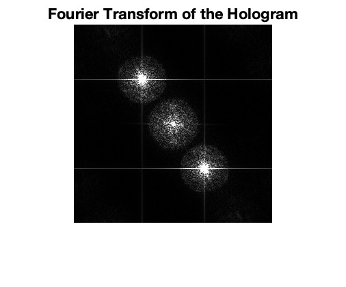
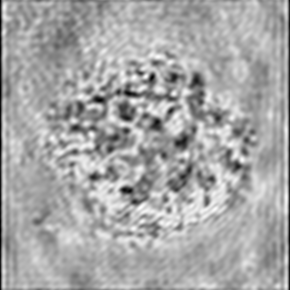
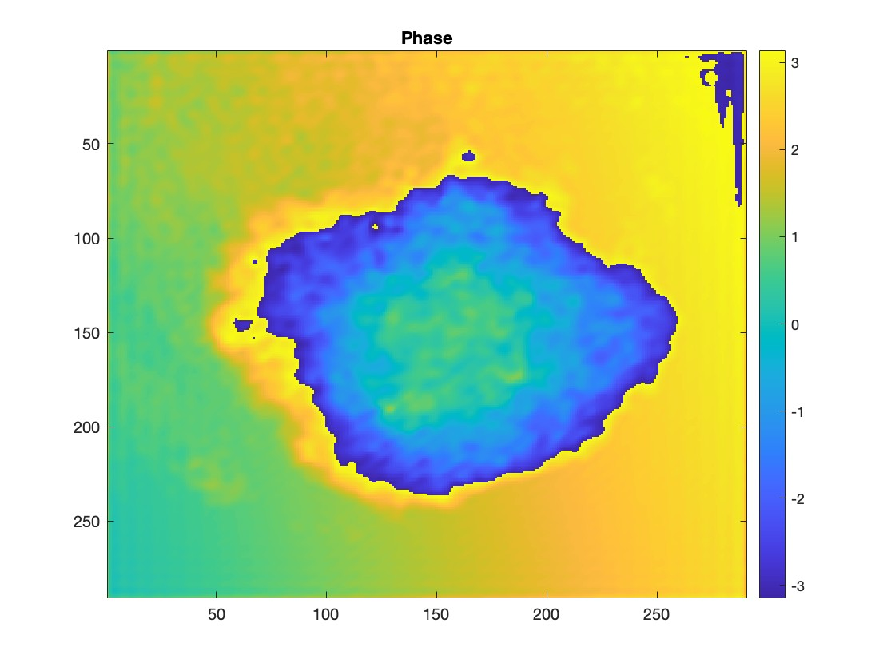
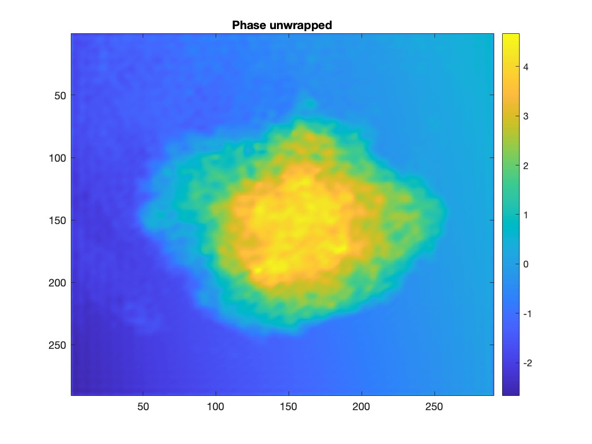
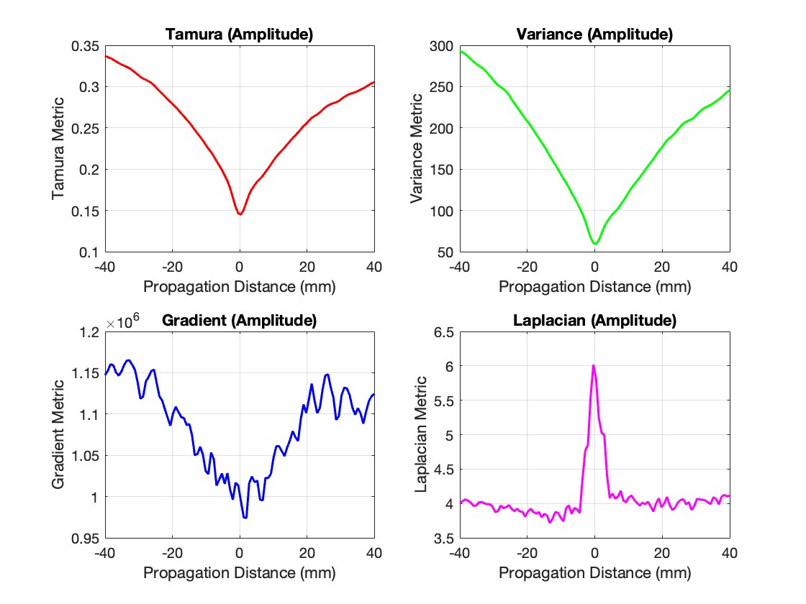
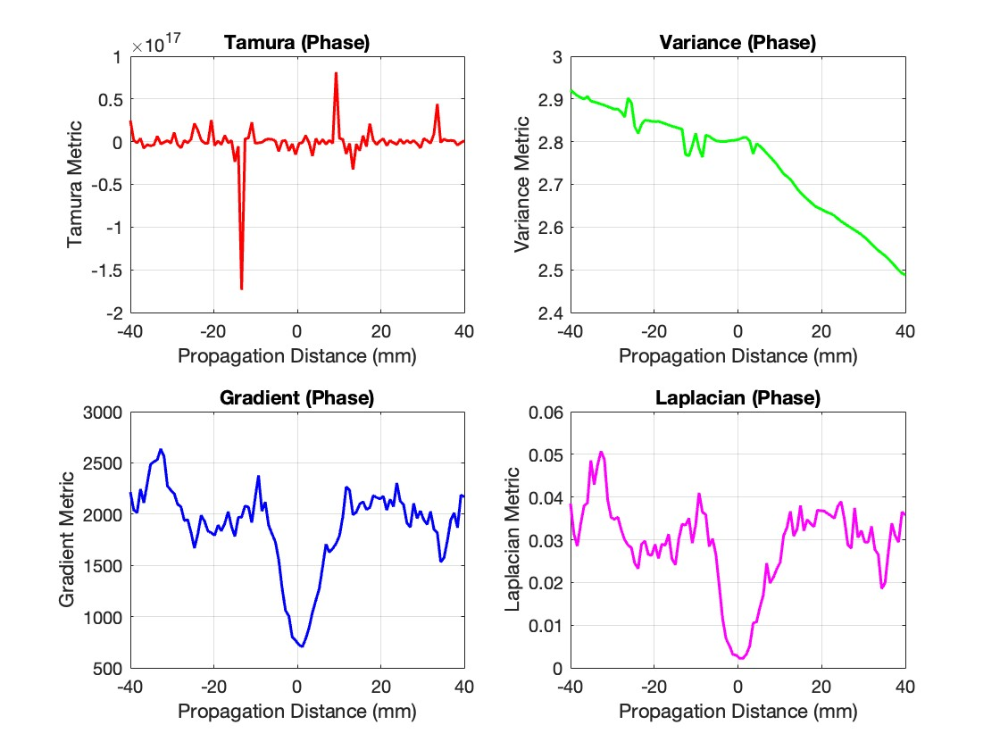
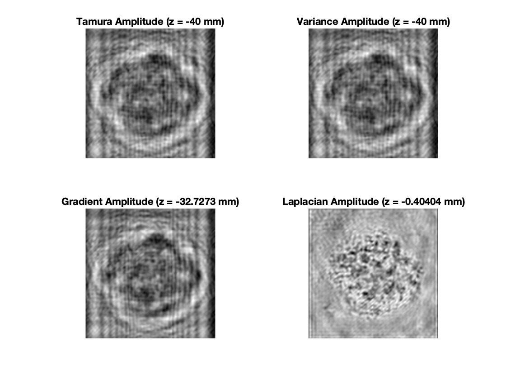
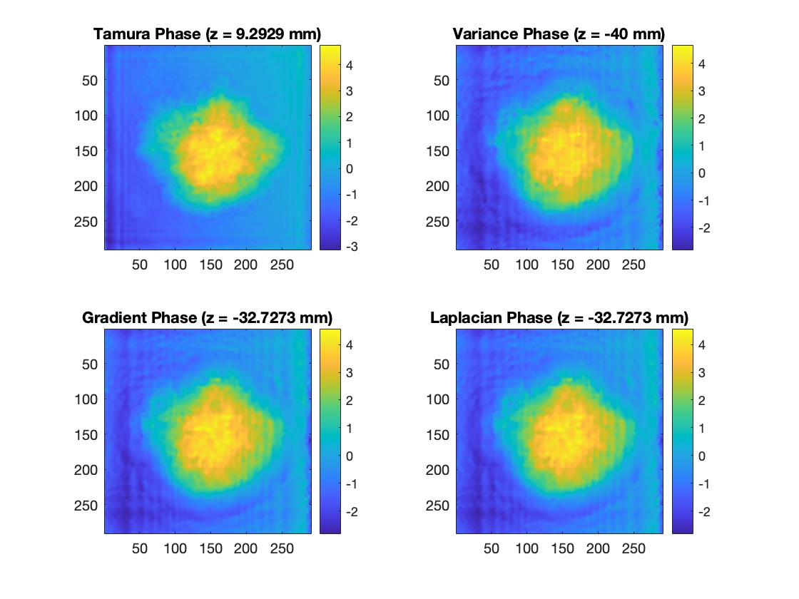

# Automatic Focusing in Digital Holography
This repository demonstrates automatic focusing in digital holography (DHM) using sharpness metrics  
(Tamura, Variance, Gradient, Laplacian). It includes reconstructed amplitude and phase results,  
sharpness curves, and a demo video of the focusing process.

Note: The MATLAB source code is not included in this repository.  
Since this project was part of a university course and may be reused as a future assignment,  
only the methodology, results, and demonstration video are provided here.

## Project Overview
Digital holography is a technique that captures both the amplitude and phase of an optical wavefront, enabling 3D reconstruction of microscopic samples.  
Precise focusing is essential: out-of-focus reconstructions lead to blurry images and degraded quantitative analysis.  
This script implements an autofocus algorithm that scans a range of reconstruction distances and computes image sharpness metrics to select the best focus plane.

## Features
- Load and preprocess off-axis hologram images  
- Fourier domain filtering and zero padding of the sideband  
- Reconstruction of the complex optical field (amplitude + phase)  
- Phase unwrapping using a DCT-based least squares algorithm  
- Fresnel propagation of the complex field over a range of distances  
- Automatic focus detection based on four sharpness metrics:
  - Tamura contrast  
  - Variance  
  - Gradient energy  
  - Laplacian variance  
- Visualization of focus curves and reconstructed images at best focus  

## Methodology
The autofocus script follows these main steps:

1. Load and preprocess an off-axis hologram  
2. Apply Fourier domain filtering and zero-padding to isolate a sideband  
3. Perform inverse Fourier transform to reconstruct the complex field  
4. Apply phase unwrapping (DCT-based least squares method)  
5. Propagate the field using Fresnel propagation over a range of distances  
6. Evaluate sharpness using four metrics:
   - Tamura contrast  
   - Variance  
   - Gradient energy  
   - Laplacian variance  
7. Identify the best focus plane and visualize amplitude and phase reconstructions  

## Example Results
- Amplitude and phase reconstructions at optimal distances  
- Sharpness vs. propagation distance plots for all metrics  
- Demonstrated focus selection consistent with expected theory  

### Fourier Domain

### Inverse Fourier Reconstruction

### Phase vs. Unwrapped Phase
| Wrapped Phase | Unwrapped Phase |
|---------------|-----------------|
|  |  |

### Autofocus Metrics – Amplitude

### Autofocus Metrics – Phase

### Reconstructions at Best Focus (Amplitude)

### Reconstructions at Best Focus (Phase)

## Demo Video
The main challenge in this project was selecting a suitable propagation distance range for reconstruction.  
This video demonstrates the correctly chosen range, where both amplitude and phase reconstructions appear sharp and clear.  

[Download and watch the demo video](media/working_range_video.mp4)

## Repository Structure
├── autofocus_dhm.m   # Main script (includes functions at the bottom: phase unwrapping and Fresnel propagation)
├── figures/          # Figures for README
│   ├── fourier_transform.jpg
│   ├── inverse_fourier.png
│   ├── phase.jpg
│   ├── phase_unwrapped.jpg
│   ├── amplitude_plots.jpg
│   ├── phase_plots.jpg
│   ├── amplitude_metrics.jpg
│   └── phase_metrics.jpg
├── media/            # Videos and animations
│   └── working_range_video.mp4
└── README.md

## Applications
- Biological cell imaging and layer discrimination  
- Detection of microscopic particles at different depths  
- Optical inspection of lenses and materials  
- Real-time analysis of dynamic samples  

## Limitations
- Sensitivity to noise in raw hologram  
- Sharpness metrics may give false maxima in low contrast conditions  
- Computational complexity increases with scan range  
- Requires clear separation between the DC term and the sidebands in the Fourier domain; insufficient separation may lead to reconstruction artifacts  
- Correctly selecting the propagation distance range is critical for reliable autofocus results

## Acknowledgments
- Course: *Introduction to Cellular and Optical Coherent Imaging*, Tel Aviv University  
- Based on methods from Ghiglia & Pritt, *Two-Dimensional Phase Unwrapping*  
- Thanks to Prof. Natan Tzvi Shaked and TA Eden Dotan for their guidance during the course  

## References
- Memmolo, P., Distante, C., Paturzo, M., Finizio, A., Ferraro, P., & Javidi, B.  
  *Automatic focusing in digital holography and its application to stretched holograms*,  
  Optics Letters 36(10), 1945–1947 (2011).  
  [DOI: 10.1364/OL.36.001945](https://doi.org/10.1364/OL.36.001945)  

- Liu, J., Song, X., Han, R., & Wang, H.  
  *Autofocus method in digital holographic microscopy*,  
  Proc. SPIE 7283, 72833Q (2009).  
  [DOI: 10.1117/12.828788](https://doi.org/10.1117/12.828788)  

- İlhan, H. A., Doğar, M., & Özcan, M.  
  *Autofocusing in digital holography*,  
  Proc. SPIE 8644, 86440C (2013).  
  [DOI: 10.1117/12.2002038](https://doi.org/10.1117/12.2002038)  

